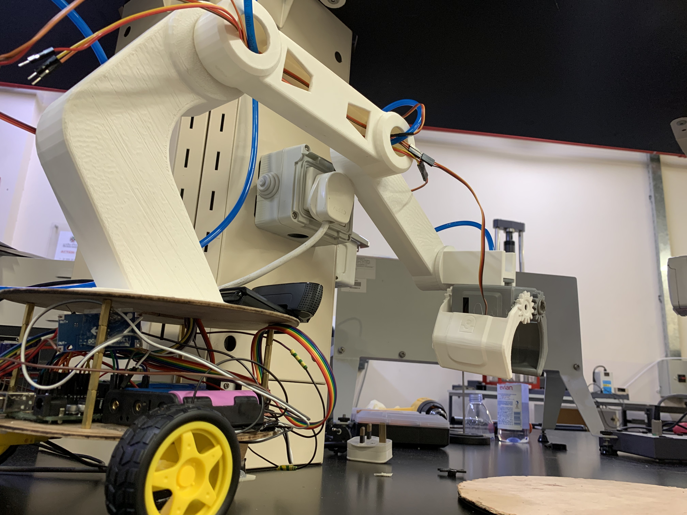
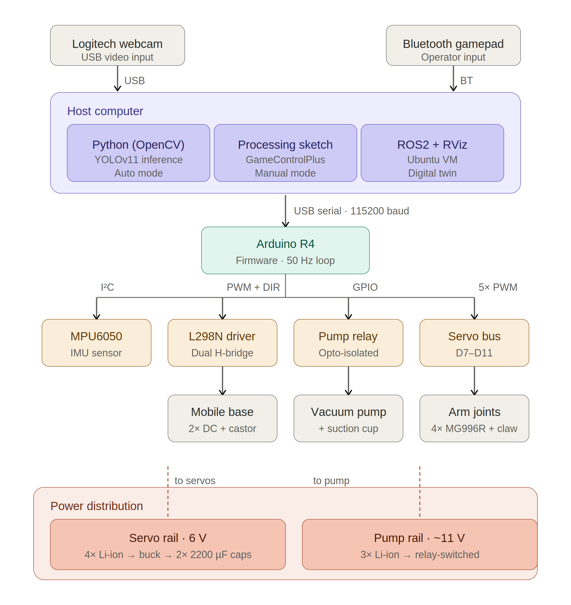

# PickMasters — Smart Pick-and-Place Robotic System


## MEC 483: Mechatronics System Design — Abu Dhabi University, Spring 2026

| Member | Role |
|--------|------|
| Leen | Group Leader — Computer Vision & Project Coordination |
| Mohamed | End Effector, Suction System & ROS Digital Twin |
| Helal | Mechanical Design, Firmware, Power System & Manual Control |



PickMasters is a mobile 4-DOF robotic arm with computer vision that can scan a workspace, identify objects, drive toward them, and pick them up. It runs in two modes: fully manual via a Bluetooth gamepad, or semi-automatic where a YOLOv11 model detects and locks onto objects while a fuzzy-logic controller steers the wheeled base to centre on the target. The end effector is a dual-gripper — a vacuum suction cup for the primary pick path and a motorised claw as backup. An MPU6050 IMU on the wrist feeds a PID loop that keeps the suction cup pointing straight down regardless of arm pose.

Everything here — the CAD files, the firmware, the vision scripts, the control logic — is documented well enough that another team can reproduce the system from this repository and the linked report sections below.

---

## [System Architecture](pages/system-overview.md)

The system splits into a host computer running high-level logic (vision, manual control UI, ROS twin) and an Arduino Uno R3 running real-time low-level control (servo PWM, motor H-bridge, pump relay, IMU reads). They talk over a single USB serial link at 9600 baud using a line-oriented protocol with an optional XOR checksum. Power comes from two independent battery rails — a 4S Li-ion pack through a buck converter at 6 V for the servos, and a 3S pack at ~11 V switched through a relay for the vacuum pump. The Arduino is USB-powered from the host.



The ten subsystems are: the 4-DOF arm (four MG996R servos + 3D-printed PLA links), the wheeled mobile base (two DC gear motors + L298N driver + castor), the dual end effector (vacuum suction cup + motorised claw), the two-rail power system, the Logitech USB webcam, the MPU6050 IMU, the Arduino Uno R3, the host computer, the YOLOv11 vision pipeline, the Processing-based manual teleoperation interface, and a ROS 2 digital twin (partially complete).

---

## [Mechanical Design](pages/mechanical-design.md)

The arm is a four-joint revolute chain: rotating base, shoulder pitch, elbow pitch, wrist pitch. The wrist is closed-loop controlled by the IMU. All structural links are 3D-printed in PLA (15% infill, 3 perimeters, 210 °C) and modelled in Autodesk Inventor with M3 mounting holes, wiring channels, and clearances for the servo horns. The mobile base is two laser-cut 3 mm acrylic platforms joined by standoff columns, with DC motor-wheel assemblies on the bottom and the arm mounted on top.

Final dimensions: shoulder-to-elbow 210 mm, elbow-to-wrist 240 mm, wrist link 180 mm, end effector ~50 mm. Total horizontal reach in a typical pose is ~570 mm, exceeding the 500 mm target. The dual end effector mounts a vacuum suction cup (primary) and a motorised claw (backup) on the same wrist bracket.


---

## [Electrical Design](pages/electrical-design.md)

The original single-rail power design failed — a current surge blew a motor, and pump switching caused logic brownouts. The final design uses two independent rails. The servo rail runs four 3.7 V Li-ion cells in series (~14.8 V) through a buck converter down to 6 V, with two 2200 µF decoupling capacitors near the servo connectors. The pump rail runs three cells in series (~11.1 V) switched by an opto-isolated relay. The L298N H-bridge drives the two DC base motors (replaced the original L293D shield, which shorted at 600 mA — the motors need 2 A).


The full Arduino Uno pin allocation is documented in the [electrical design page](pages/electrical-design.md), including the L298N direction/PWM pins, servo signal pins, relay control, IMU I²C lines, and the safety interlock input on A0.

---

## Code and Firmware

This is the core of the project — four programs across three languages that together make the robot work. The final production code lives in [`Final Code/`](Final%20Code/), with earlier development iterations in [`Arduino Code/`](Arduino%20Code/) and [`OpenCV/`](OpenCV/).

### [ArmController.ino — Manual Mode Firmware](pages/embedded-control.md)

[`Final Code/ArmController_PID_Safety/ArmController.ino`](Final%20Code/ArmController_PID_Safety/ArmController.ino)

The manual-mode Arduino sketch. It drives all four arm servos, both DC base motors, the pump relay, and the IMU-based wrist auto-levelling loop. The main loop runs at full ATmega328P speed with IMU/wrist updates gated at 50 Hz. It includes a safety interlock state machine: a single `safetyClear` boolean that is the AND of the hardware e-stop pin (A0), serial link liveness (2 s timeout), and IMU health. If any condition fails, the pump and motors are forced off immediately. The AVR hardware watchdog is set at 2 s — a hung I²C read or infinite loop triggers a full reset to the safe state.

The serial protocol is line-oriented at 9600 baud:
```
S<shoulder>,<elbow>,<wrist>,<hand>,M<left>,<right>,P<0|1>,W<0|1>*<XX>
```
The `*XX` suffix is an XOR checksum over all preceding bytes. Mismatches are rejected; commands without it are accepted for terminal debugging.

The wrist PID runs with **Kp = 1.0, Ki = 0.05, Kd = 0.15**, integral anti-windup clamped to ±30°·s, output saturated to the 0–180° servo range. Setpoint is 0° (level); the process variable is pitch from `atan2(Ax, Az)` minus a calibration offset taken at boot.

### [PickAndMove.ino — Automatic Mode Firmware](pages/embedded-control.md)

[`Final Code/PickAndMove_FuzzyLogic/PickAndMove.ino`](Final%20Code/PickAndMove_FuzzyLogic/PickAndMove.ino)

The automatic-mode Arduino sketch. It only drives the two DC base motors — arm servos are inactive, and the operator switches back to manual mode for the actual pick. The controller is a Mamdani fuzzy-logic system that maps absolute pixel error (distance between the detected object centre and the camera frame centre) to motor PWM speed. Three trapezoidal input membership functions (Small, Medium, Large) map to three output singletons (Slow = 80, Medium = 150, Fast = 230 PWM). Defuzzification is centre-of-gravity weighted by firing strength. Motion is pulse-based: motors run 70 ms then auto-stop, and the host re-sends pulses as long as motion is needed — a dead-man's-switch design where any communication failure halts the robot.

### [detect_and_move.py — Vision and Auto-Control Script](pages/software-design.md)

[`Final Code/detect_and_move.py`](Final%20Code/detect_and_move.py)

The Python host script for automatic mode. It loads a YOLOv11n model (`best.pt`, ~5 MB), opens the USB camera via OpenCV, and opens the Arduino serial port. Each frame: run inference in tracking mode (persistent object IDs), overlay bounding boxes and a target reference box in the centre of the frame. The script locks onto the highest-confidence detection above 50% and ignores others until the operator presses `n`. Per-frame pixel errors are compared against a 30-pixel dead zone — horizontal error out of band sends `FUZZY_PIVOT`, vertical out of band sends `FUZZY_DRIVE`, both in band sends `STOP`.

The YOLOv11n model was trained on a Google Colab Tesla T4 for 50 epochs at 640×640. Training data: 237 images per class across five classes (Ball, Bolt, Compass, Egg, Screw), collected with the same Logitech webcam, annotated in Roboflow with augmentation (flips, rotation, brightness). The nano variant was chosen so inference runs at ~15 fps on a laptop CPU. Detection confidence is >90% for bolt, ball, compass, and screw; 85–95% for egg depending on lighting.


### [DriveControl.pde — Manual Gamepad Interface](pages/software-design.md)

[`Final Code/DriveControl/DriveControl.pde`](Final%20Code/DriveControl/DriveControl.pde)

The Processing IDE sketch for manual teleoperation. It reads a Bluetooth gamepad via the GameControlPlus library, applies a 0.2 deadzone on all analog axes, and sends serial commands at up to 50 Hz (only when a value changes). Mapping: left stick drives the base wheels (forward/back, rotate); D-pad controls shoulder and elbow pitch; right stick overrides the hand/claw; face buttons toggle the pump and IMU calibration.

---

## [Computer Vision Pipeline](pages/software-design.md)

The vision pipeline has four stages. First, 237 images per class are captured with the deployment camera under varied lighting and angles — training on clean backgrounds caused excessive false positives, so the second iteration used realistic workspace backgrounds. Second, images are uploaded to Roboflow for bounding-box annotation and augmentation (flips, rotation, brightness). Third, the augmented dataset is pulled into Google Colab via the Roboflow API and used to train YOLOv11n for 50 epochs at 640×640 on a Tesla T4 GPU. Fourth, the best checkpoint (`best.pt`) is deployed into `detect_and_move.py` for real-time inference.


---

## [Sensing and Signal Conditioning](pages/sensing.md)

Three sensor channels feed the system. The Logitech USB webcam is fixed to the mobile base looking outward — its view shifts as the base pivots, which the fuzzy controller exploits. The MPU6050 IMU is mounted on the wrist and communicates over I²C; the firmware reads raw accelerometer values, computes pitch via `atan2`, and feeds the PID loop at 50 Hz. The Bluetooth gamepad connects to the host; the Processing sketch polls axes and buttons every frame with a 0.2 deadzone.

---

## [Mathematical Modelling](pages/modelling.md)

The arm is modelled as a three-link planar serial chain using Denavit-Hartenberg parameters (shoulder→elbow 210 mm, elbow→wrist 161 mm, wrist→tip 180 mm). Static torque at worst case (fully horizontal) is 0.697 N·m; the MG996R delivers 1.08 N·m at 6 V, giving a 1.55× margin. The servo is modelled as a second-order plant with ωₙ = 62.83 rad/s and ζ = 0.70. The wrist PID open-loop Bode analysis shows a phase margin of ~179° and effectively infinite gain margin — the conservative gains favour stability over bandwidth, which suits the quasi-static wrist levelling task.

---

## [Integration and Testing](pages/integration-testing.md)

The final system was assembled bottom-up: base platform with motors, then electronics between platforms, then arm link-by-link, then end effector and tubing. Calibration sets servo zero angles, captures the IMU pitch offset (average of 50 readings), and adjusts camera tilt until the workspace fills the frame.

Testing confirmed: manual gamepad control with subjectively instantaneous response across all axes; object detection at >90% confidence for four of five classes (egg at 85–95%); automatic base motion that correctly pivots and drives to centre on the target; wrist auto-levelling with no visible oscillation; reliable vacuum pick of the ball and compass.

Two objectives were not met. Camera-to-workspace coordinate mapping was not completed, so the arm centres on the object but cannot inverse-kinematic to its position — the pick step is handed to the operator. The ROS 2 digital twin renders in RViz but the URDF joint transforms are not configured, so it does not articulate.


---

## [Lessons Learned](pages/lessons-learned.md)

Size drivers from the load's stall current, not from form factor — the L293D shorted because it was chosen for convenience. Add decoupling capacitors from the start — a transient blew a motor before caps were added. Use separate power rails for different load types — sharing caused brownouts. Build tolerance buffers into 3D-printed parts and print test-fit prototypes. Train detection models on realistic deployment backgrounds from day one. Scope ambitiously but guarantee the headline feature — a smaller initial scope would have yielded a fully autonomous system.

---

## [Future Work](pages/future-work.md)

The immediate next step is completing camera-to-workspace coordinate mapping and adding an inverse-kinematics solver to close the automatic pick-and-place loop. After that: fix the URDF joint transforms for a functional ROS 2 digital twin, add Hall-effect encoders to the DC base motors for closed-loop position control, implement per-object grasp selection (suction vs. claw based on detection class), and eventually replace the Arduino with a PLC for industrial hardening.

---

## Appendices

| Resource | Description |
|----------|-------------|
| [Presentations](pages/presentations.md) | Weekly progress slide decks from Week 2 through Week 12 |
| [References](pages/references.md) | Full bibliography — Bolton, Spong, Craig, Nise, YOLO, OpenCV, ROS, datasheets |
| [Bill of Materials](pages/bill-of-materials.md) | Complete parts list with quantities |
| [User Manual](pages/user-manual.md) | Power-on/off sequence, manual and automatic mode operation |
| [Software Listings](pages/software-listings.md) | Links to all four source files in the repo |
| [Final Code](pages/final-code.md) | Production firmware, vision script, and trained model |
| [Development Sketches](pages/arduino-code.md) | Development-stage Arduino and Processing sketches |
| [Vision Scripts](pages/opencv-code.md) | Vision development scripts and model files |

---

> **Repository:** [github.com/PickMasters](https://github.com/PickMasters)
