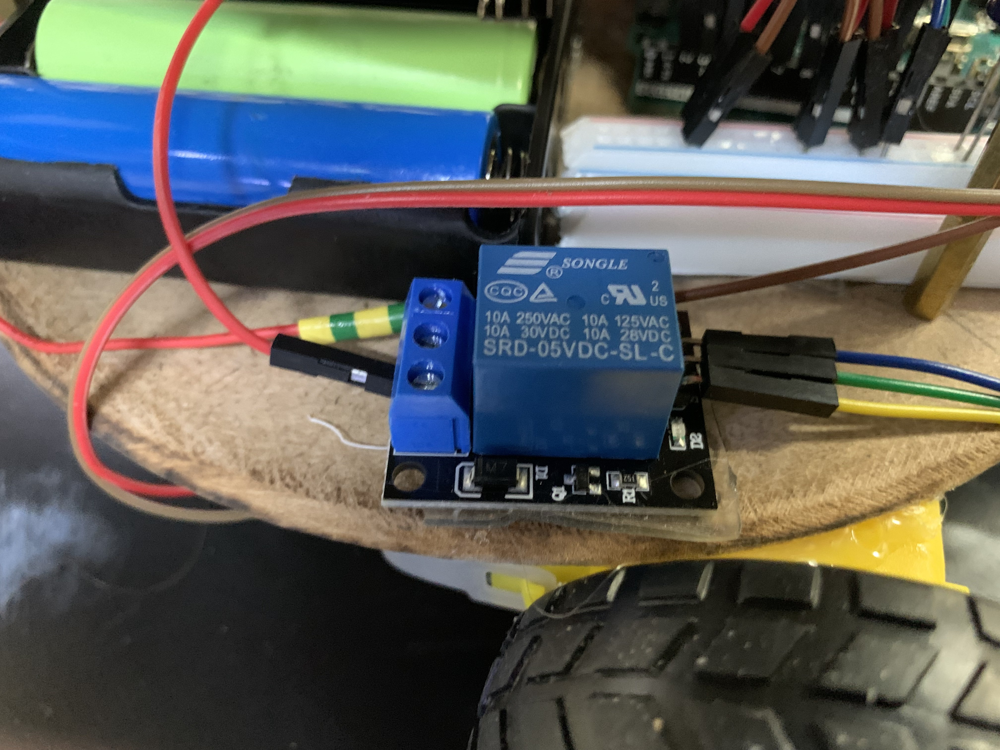

# 8. Actuation

[← Back to Home](../index.md)

---

## 8.1 Servo Torque Justification

MG996R at all four arm joints — ~11 kg·cm at 6 V. Worst-case static load: elbow link + wrist link + end effector ≈ 150 g at the elbow's 240 mm moment arm → 0.15 × 24 = 3.6 kg·cm. Margin ≈ 3× the servo's stall torque, adequate for static holding with some dynamic loading headroom. No external gear reduction was added — the MG996R's internal metal-gear reduction is sufficient, and an extra stage would add backlash and complexity.

## 8.2 Direct-Current Motor Selection

Compared: brushed DC + encoder, stepper, hobby servo. See Table 3.

**Table 3 — Actuator selection matrix** *(asterisk = selected)*

| Role | Candidate | Bolton ref. | Torque / speed | Switching | Control | Decision |
|---|---|---|---|---|---|---|
| Arm joints | MG996R hobby servo* | Sec. 9.8 | 11 kg·cm stall @ 6 V — 3× margin | Internal H-bridge | Closed-loop (internal) | Selected — integrated control, adequate torque |
| Arm joints | Stepper (NEMA 17) | Sec. 9.7 | ~4 kg·cm — marginal at full extension | External A4988 | Open-loop step | Rejected — heavier, larger driver footprint |
| Arm joints | Brushed DC + encoder | Sec. 9.5 | Variable; requires gearbox | External H-bridge | External PID | Rejected — integration effort vs marginal gain |
| Mobile base | JGA-25 geared DC* | Sec. 9.5 | ~3 kg·cm @ 6 V; integrated reduction | L298N H-bridge | Open-loop PWM | Selected — drop-in mechanical fit with wheel |
| Mobile base | Stepper motor | Sec. 9.7 | Adequate but heavy | Stepper driver | Open-loop step | Rejected — weight penalty, higher current |
| Mobile base | Continuous-rotation servo | Sec. 9.8 | Lower torque than geared DC | Internal | PWM duty cycle | Rejected — insufficient torque for the payload |

## 8.3 Pump Selection

12 V vacuum pump, ~0.1 atm. Tested empirically against each object — reliably lifts ball and compass; partial seal sufficient for the bolt.

## 8.4 Solid-State Switching

Pumps and DC motors cannot be driven directly from Arduino pins [1, Sec. 9.3]. Solutions: L298N H-bridge for the motors (dual 2 A channels, direction + PWM speed), single-channel opto-isolated relay for the pump (NO contacts so default OFF; coil powered from Arduino 5 V).

---

[← Back to Home](../index.md)
