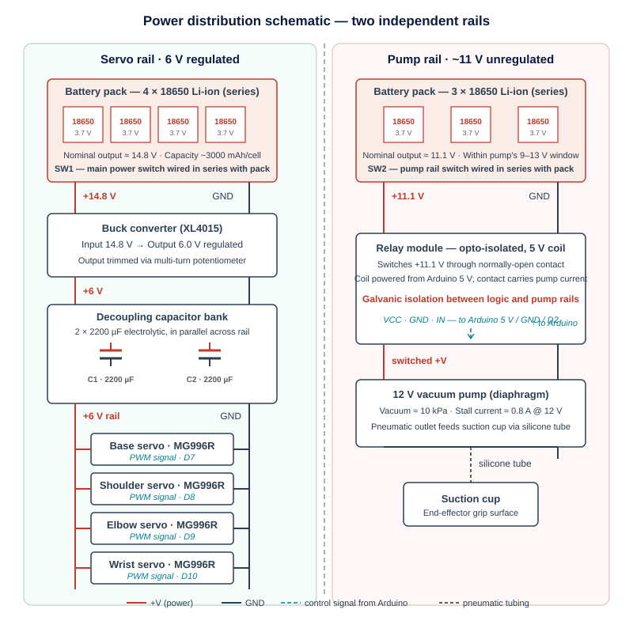
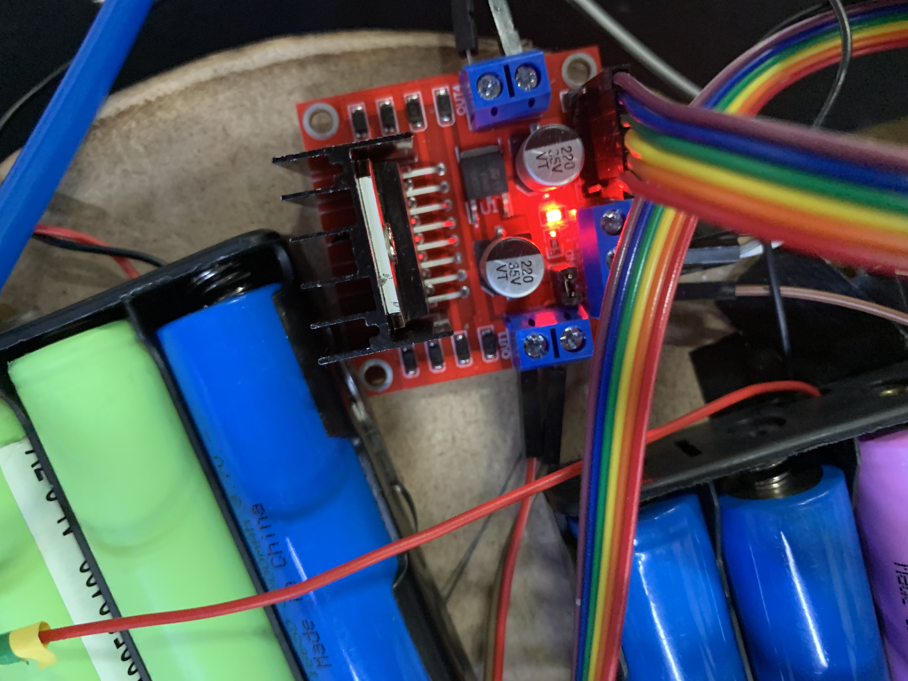
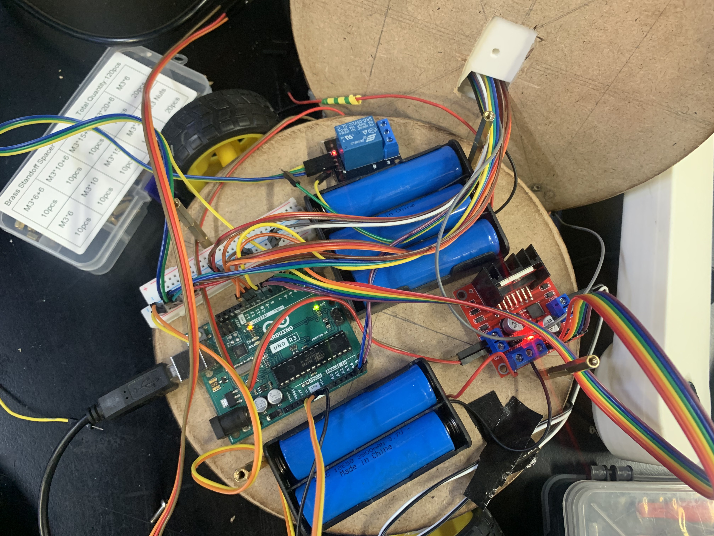

# Electrical Design

[← Back to Home](../index.md)

---

## Power Architecture Rationale

Two-rail design [1, Sec. 3.7]. The original single-rail design failed: a motor blew during testing when a current surge crashed the rail, and switching the pump caused brownouts on the logic supply.

Servo rail: four 3.7 V Li-ion cells in series → ~14.8 V → buck converter to 6 V. Four MG996R servos stalling simultaneously can draw ~10 A (2.5 A each from datasheet). Two 2200 µF electrolytic capacitors across the rail near the servo connectors act as a local energy reservoir for transients — added after the burn-out incident.

## Pump Rail

Three 3.7 V Li-ion cells in series → ~11.1 V (within the 12 V pump's tolerance). Switched on/off by a relay module driven by an Arduino digital pin. Relay isolates pump current from logic current.

## Component Selection

### Microcontroller

Arduino Uno R3 (ATmega328P): 14 digital I/O, 6 analog inputs, hardware serial + I²C, 5 V logic. Within budget, familiar IDE.

### Motor Driver — Design Lesson

Original: L293D motor shield. It shorted during testing — only 600 mA per channel continuous, insufficient for the base motors. Replaced with a standalone L298N (2 A per channel with heatsink). Lesson: pick the driver from the motor's stall current, not from form-factor convenience.

### Sensor Selection

**Table 1 — Sensor selection matrix** *(asterisk = selected)*

| Function | Candidate | Bolton ref. | Selection rationale |
|---|---|---|---|
| Object detection | USB webcam (Logitech)* | Sec. 2.6 | Sufficient resolution for YOLO; standard driver; OpenCV-supported |
| Object detection | Depth camera (RealSense) | Sec. 2.6 | Higher capability but unnecessary and over budget |
| Object detection | LiDAR scanner | Sec. 2.6 | Designed for ranging, not classification; unsuited to the task |
| Orientation feedback | MPU6050 IMU (3-axis accel + gyro)* | Sec. 2.3 | Low cost, I²C, mature Arduino library support |
| Orientation feedback | BNO055 (9-DoF, fused) | Sec. 2.3 | Better fusion but ~5× cost and unnecessary for wrist-only pitch |
| Orientation feedback | ADXL345 (accel only) | Sec. 2.3 | Lacks gyroscope; no upgrade path for drift compensation |
| Joint position | Servo internal potentiometer* | Sec. 2.3 | Built into MG996R; no external wiring required |
| Joint position | External rotary encoder | Sec. 2.3 | Higher resolution but redundant given built-in feedback |
| Joint position | Position-sensitive detector | Sec. 2.3 | Higher accuracy but mechanical packaging impractical |
| Human input | Bluetooth gamepad* | Sec. 6.5 | Wireless freedom; sufficient axes and buttons |
| Human input | Wired gamepad | Sec. 6.5 | Restricts operator mobility; no other advantage |
| Human input | Keyboard | Sec. 6.5 | Discrete inputs only; poor fit for analog joint control |

### Actuator Selection

MG996R hobby servos at all four arm joints (~11 kg·cm at 6 V — adequate margin vs. worst-case joint torque). Mobile base: two DC gear motors with integrated wheels (no separate coupling needed). Vacuum pump: 12 V, ~0.1 atm — enough to lift the three target objects with a clean seal. Claw uses a standard hobby servo.

## Arduino Pin Allocation

**Table 2 — Arduino Uno pin allocation**

| Pin | Type | Function | Connection |
|---|---|---|---|
| D2 | Digital out | DC motor — left direction A (IN1) | L298N IN1 |
| D3 | Digital out | Pump relay control (active LOW) | Relay module signal input |
| D4 | Digital out | DC motor — left direction B (IN2) | L298N IN2 |
| D5 | Digital out (PWM) | DC motor — left speed (ENA) | L298N ENA |
| D6 | Digital out (PWM) | DC motor — right speed (ENB) | L298N ENB |
| D7 | Digital out | DC motor — right direction A (IN3) | L298N IN3 |
| D8 | Digital out | DC motor — right direction B (IN4) | L298N IN4 |
| D9 | Digital out (PWM) | Shoulder servo signal | Shoulder MG996R signal |
| D10 | Digital out (PWM) | Elbow servo signal | Elbow MG996R signal |
| D11 | Digital out (PWM) | Wrist servo signal | Wrist MG996R signal |
| D12 | Digital out | Hand (claw) servo signal | Hand MG996R signal |
| A0 | Digital in | Safety interlock input (HIGH = clear) | External safety / e-stop circuit |
| A4 | I²C SDA | IMU data line | MPU6050 SDA |
| A5 | I²C SCL | IMU clock line | MPU6050 SCL |
| 3.3 V | Power out | IMU supply | MPU6050 VCC |

## Wiring Procedure

Step-by-step build: connect L298N power inputs to the servo rail and grounds to the common bus; connect L298N IN1–IN4 and ENA/ENB to the Arduino pins per Table 2; wire each MG996R signal lead to its allocated PWM pin, and the servo V+/GND to the 6 V rail (NOT the Arduino 5 V); wire the relay signal pin to D3 and the relay's switched output to the pump and pump rail; wire the IMU to 3.3 V, GND, SDA→A4, SCL→A5 (module has built-in pull-ups); pre-power check — verify continuity to common ground and no shorts between rails before connecting any battery.

---

[← Back to Home](../index.md)
