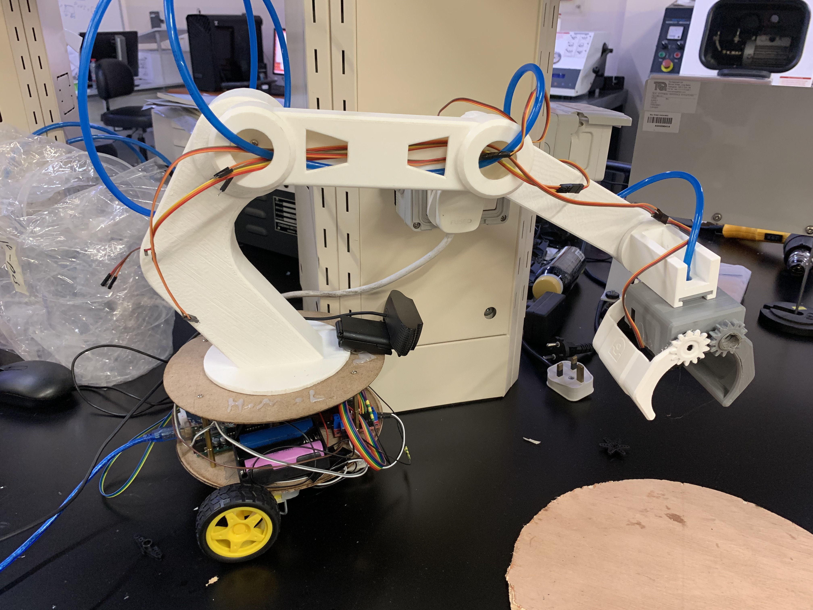
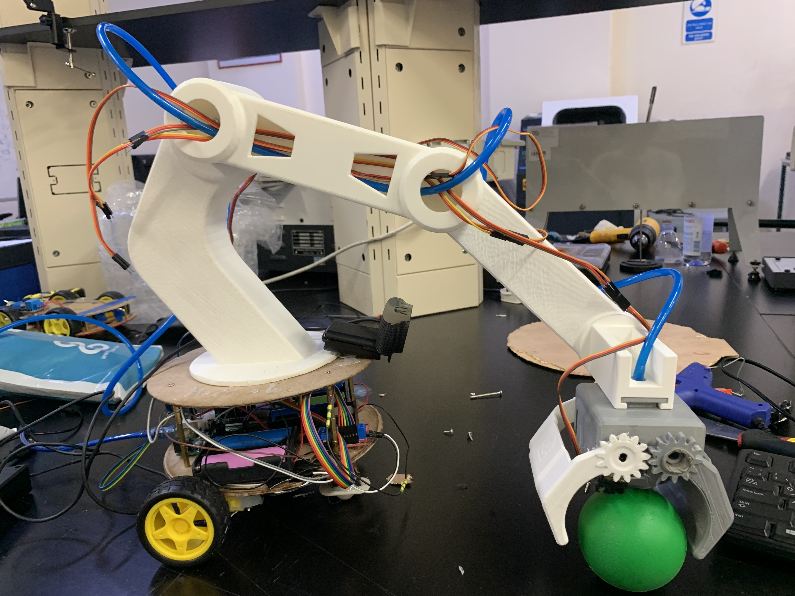

# 12. Final Integration and Testing

[← Back to Home](../index.md)

---

## 12.1 Assembly Sequence

(1) DC motors + wheels + castor → bottom platform; standoffs to top platform. (2) Arduino, relay, buck converter, batteries, L298N → between platforms. (3) Arm base → top platform; wires through cable hole. (4) Arm assembled link-by-link upward, each servo mounted and wired before the next link. (5) End effector on wrist. (6) Tubing from pump to suction cup.

## 12.2 Calibration Procedure

Move the arm to a known reference pose; store the servo angles as zero. Place wrist level and issue the IMU calibration command — firmware averages 50 readings as the pitch offset. Adjust camera tilt and arm home pose until the workspace fills the frame at home. Gamepad deadzone tuned to absorb analog-stick drift observed during testing.

## 12.3 Testing Protocol and Results

**Manual control:** every gamepad axis tested individually — left stick wheels, right stick shoulder/elbow, triggers wrist, face buttons pump, bumpers base rotation. Response was subjectively instantaneous.

**Object detection:** all five objects tested individually in the workspace. Bolt, ball, compass, screw — confidence > 90%. Egg — confidence 85–95% depending on lighting. Multi-object frames were also correctly handled.

**Automatic motion:** objects placed in the workspace, script started — detection correct, left/right judgment correct, base pivoted to centre, system stopped on completion as designed, awaiting manual pick. Wrist auto-levelling stayed pointing down across full arm motion with no visible oscillation or drift. Suction pump reliably picked the compass and ball in repeat trials.

## 12.4 Acknowledged Limitations

Two unmet objectives. **Full auto pick-and-place:** camera-to-workspace coordinate mapping was not completed, so the arm centres on the object but cannot inverse-kinematic to its exact location. The pick step is handed to the operator. **ROS 2 digital twin:** the CAD model loads and renders in RViz but the joint transforms are not configured, so the simulated arm does not articulate. Both are documented openly — covered-up failures help no one. Both are addressed in Future Work.

---

[← Back to Home](../index.md)
