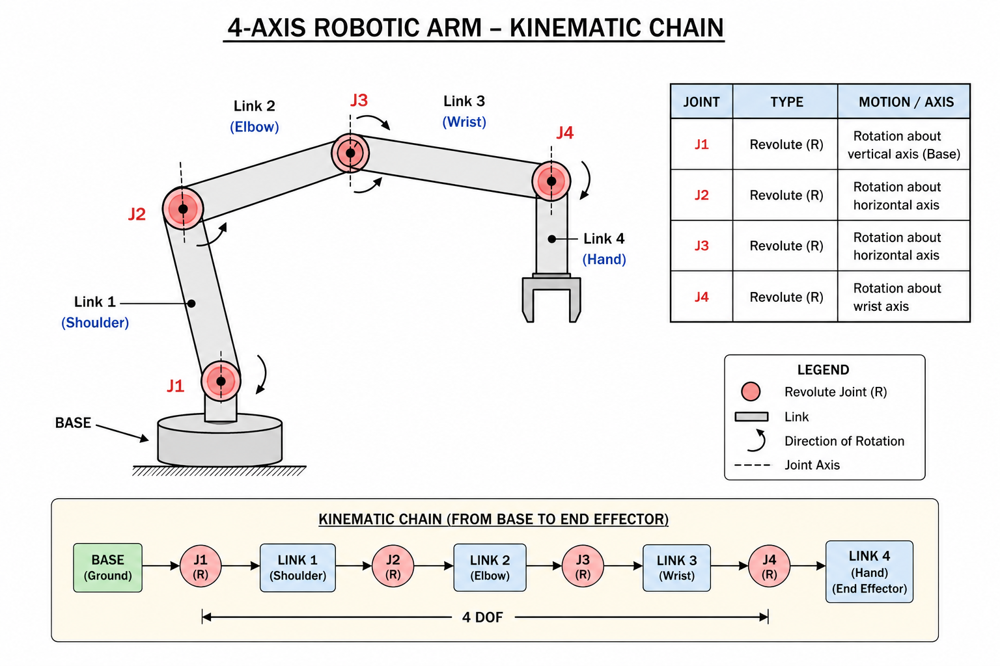
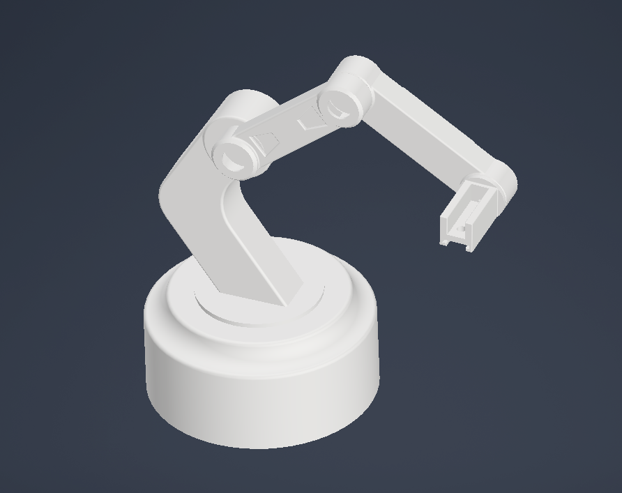
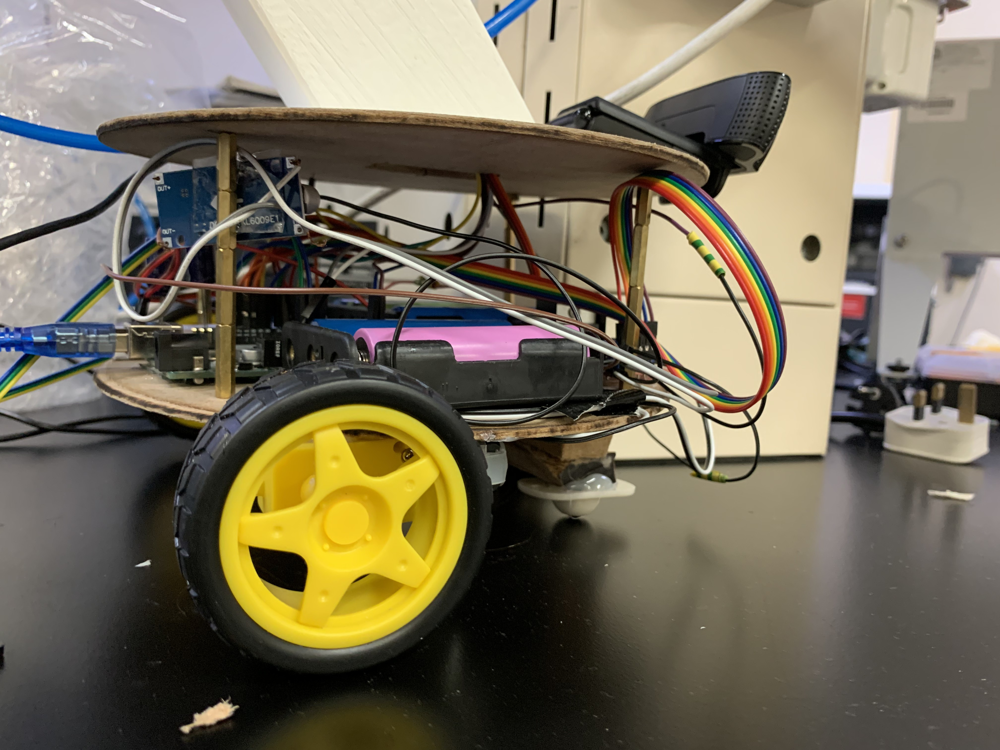
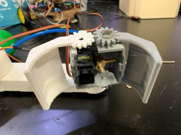

# Mechanical Design

[← Back to Home](../index.md)

---

## Design Rationale

Constraints: target horizontal reach ~500 mm; weight stays within MG996R servo limits; print volume fits an entry-level FDM printer. Four DOF (base rotation, shoulder pitch, elbow pitch, wrist pitch) gives a hemispherical workspace while remaining controllable from one Arduino with the standard Servo library. Structural links 3D printed in PLA (cheap and stiff enough); mobile-base platforms laser-cut from wood (flat geometry suits laser cutting and gives better strength-to-weight for that shape).

## Kinematic Chain

The kinematic chain runs: mobile base → rotating arm base → shoulder → elbow → wrist → end effector. The shoulder and elbow are pitch joints; the wrist is closed-loop-controlled by the IMU feedback. Revolute joints use the MG996R's built-in bearings rather than external ones — at the expected loads this is adequate and avoids unnecessary mechanical complexity.

## Final Dimensions

Mobile base diameter ~300 mm; two acrylic platforms ~80 mm apart. Arm base height (excluding shoulder) ~150 mm, placing the shoulder pivot ~361 mm above the floor. Shoulder-to-elbow link 210 mm centre-to-centre. Elbow-to-wrist link 240 mm. Wrist link ~180 mm. End effector adds ~50 mm. Total horizontal reach in a typical operating pose: ~570 mm (exceeds the target).

## Computer-Aided-Design Workflow

Modelled in Autodesk Inventor. Each link a separate part with mating surfaces for the servo bodies and clearance for the horns. Wiring channels routed through the structure. M3 mounting holes at 3.3 mm with countersinks where appropriate. Exported STL → sliced for FDM. Print settings: 15% infill, 3 perimeters, 3 top/bottom layers, 210 °C extruder, 60 °C bed, PLA.

## Mobile Base Construction

Two laser-cut acrylic platforms (3 mm thick) joined by four standoff columns. DC motors with wheels on the bottom platform; castor wheel for stability; arm mounts on the upper platform with a wire-routing cutout. Arduino sits between the platforms (upper platform liftable for service). First two cuts failed at the wire-routing cutout (geometry too thin); a third pass with a larger fillet was structurally sound.

## End Effector Design

Dual gripper: vacuum suction cup (primary) and motorised claw (backup), both mounted on a shared bracket on the wrist servo. Suction is the primary path — it handles all three target objects (bolt, ball, compass) without modification: the ball seals against the cup curvature; the compass case sits flat in the cup. The claw is a fail-safe for objects suction cannot handle.

---

[← Back to Home](../index.md)
