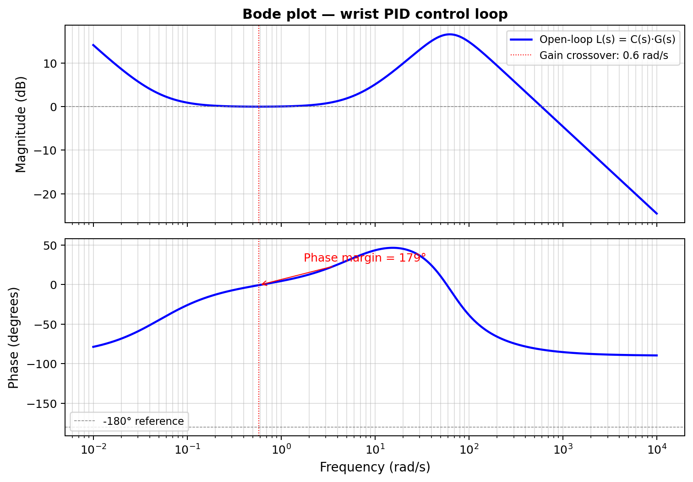

# Mathematical System Modelling

[← Back to Home](../index.md)

---

## Modelling Objectives and Approach

Three goals: confirm static torque margins at worst-case configuration; derive the closed-loop wrist transfer function and analyse stability/bandwidth in the frequency domain [1, Ch. 18, 19]; provide a baseline for prototype comparison. Approach: lumped-parameter, rigid-body links, single viscous-damping coefficient per joint, second-order internal servo model [1, Ch. 17].

## Kinematic Chain — Denavit–Hartenberg Parameters

Modelled as a three-link planar serial chain of revolute joints. The hand servo is a separate 1-DOF gripper (no end-effector reference change). Base rotation is delivered by the mobile-base differential drive, so it is not part of the arm chain.

**Table 4 — Denavit–Hartenberg parameters for the three-link planar arm**

| Link i | θᵢ (variable) | dᵢ (mm) | aᵢ (mm) | αᵢ (rad) |
|---|---|---|---|---|
| 1 (shoulder → elbow) | θ₁ | 75 | 210 | 0 |
| 2 (elbow → wrist) | θ₂ | 0 | 161 | 0 |
| 3 (wrist → tip) | θ₃ | 0 | 180 | 0 |

End-effector tip position in the mobile-base frame is the closed-form product of homogeneous transforms; full derivation in Spong et al. [2, Ch. 3] and Craig [3, Ch. 3].

## Link Mass Estimates

PLA prints with ~30% infill — using a labelled density of 0.40 g/cm³. Inventor volume × density, then validated by direct weighing. Values: shoulder link 143.5 g; elbow link 53.5 g; wrist link 52.4 g; hand assembly 29.5 g; mobile base + electronics 300 g. Arm-only mass ≈ 279 g.

## Static Torque Verification at the Shoulder

Worst case: fully extended horizontally, each centre of mass at maximum horizontal offset. Required holding torque = Σ(mᵢ·g·dᵢ) over outboard masses (shoulder link at a₁/2; elbow link at a₁+a₂/2; wrist link at a₁+a₂+a₃/2; hand assembly as a point mass at a₁+a₂+a₃). Result: **0.697 N·m.** MG996R stall: 1.08 N·m at 6 V. Static torque margin: **1.55×.** Acceptable for static loads but not generous — manual control deliberately limits joint step rates.

## Moment of Inertia about the Shoulder

Parallel-axis theorem [1, Sec. 17.2]: each link's I = m·L²/12 + m·d² (treating links as uniform rods, hand as a point mass at the tip). Worst-case total at full extension: **J ≈ 0.0270 kg·m².**

## Servo Transfer Function

Second-order model per joint. Newton's second law for rotation: J·θ̈ + b·θ̇ = τ. Substituting the internal proportional law τ = K·(θ_cmd − θ):

```
J·θ̈ + b·θ̇ + K·θ = K·θ_cmd
G(s) = K / (J·s² + b·s + K)
```

with ωₙ = √(K/J), ζ = b / (2√(K·J)). MG996R internals are a black box, but empirical bandwidth ≈ 10 Hz with moderate damping [1, Ch. 19]. Choosing **ωₙ = 62.83 rad/s (10 Hz), ζ = 0.70** with worst-case J = 0.0270 kg·m²: b ≈ 2.372 N·m·s/rad; K ≈ 106.5 N·m/rad. Normalised plant:

```
G(s) = 3947.8 / (s² + 87.96·s + 3947.8)
```

## Wrist PID Loop — Open-Loop Bode Analysis

Parallel-form PID with the firmware gains from §9.6:

```
C(s) = Kp + Ki/s + Kd·s = (Kd·s² + Kp·s + Ki) / s
L(s) = C(s)·G(s)
```



Three notable features: (1) magnitude is near 0 dB across the mid-band (~0.1–10 rad/s) due to unity Kp and unity plant DC gain; (2) a ~17 dB resonance near 60 rad/s at the plant natural frequency, lifted by the Kd·s term; (3) a 40 dB/decade roll-off above ωₙ from the second-order plant.

## Stability Margins and Discussion

Gain crossover ≈ 0.58 rad/s (0.092 Hz). Phase near 0° there → **phase margin ≈ 179°**. Phase never crosses −180° in band → **effectively infinite gain margin**. The conservative gains favour stability over speed. Good fit for wrist auto-levelling (disturbance is essentially DC); poor fit for high-bandwidth target tracking. The worst-case inertia overstates the slowness — at the home position J is several times smaller and the loop is faster.

---

[← Back to Home](../index.md)
