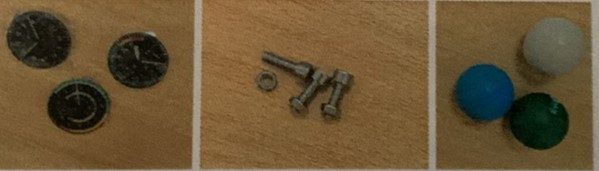

# Problem Definition

[← Back to Home](../index.md)

---

## Problem Statement

Industrial pick-and-place tasks — sorting parts on an assembly line, packaging products, removing defective items from a stream — are repetitive, error-prone when performed by humans, and a natural fit for mechatronic automation. The same issues exist at smaller scale in laboratory environments, retail fulfilment, and any application requiring identification, localisation, and transportation of an object without human involvement. The difficulty is integrating mechanical structure, electrical power and signalling, control logic, and computer vision into one coherent platform.

The aim of this project is to construct a small-scale, educational pick-and-place robotic system that illustrates the essential concepts of mechatronic integration. The system should detect objects, move to them, pick them up, and also be controllable by a human operator. It should run on standard hobby-grade parts within budget and be repeatable — documented well enough for another team to reproduce it from the report.

## Impact Statement

The educational value lies in the integration challenge, not in any single subsystem. Commercial pick-and-place arms exist. Suction-cup grippers exist. Computer vision libraries exist. What is not available as a ready-made product is the integrated package developed by students and put together into a working system across each engineering discipline. The project results in a working prototype usable for teaching future students about sensor selection, power distribution, embedded control, and computer vision.

## Design Criteria and Constraints

**Criteria:** horizontal reach of 300–500 mm; 4-DOF arm structure; object detection accuracy ≥ 90%; manual control response time under 200 ms; both manual and automatic operating modes.

**Constraints:** Original design (no kits or pre-made assemblies); fabrication by 3D printing and laser cutting; microcontroller restricted to Arduino Uno R3 (ATmega328P); battery powered for mobile operation; target objects were a compass, a ball, and a bolt (with an egg and screw added mid-test by the instructor to test robustness); allowed languages were C, C++, and Python.

---

[← Back to Home](../index.md)
