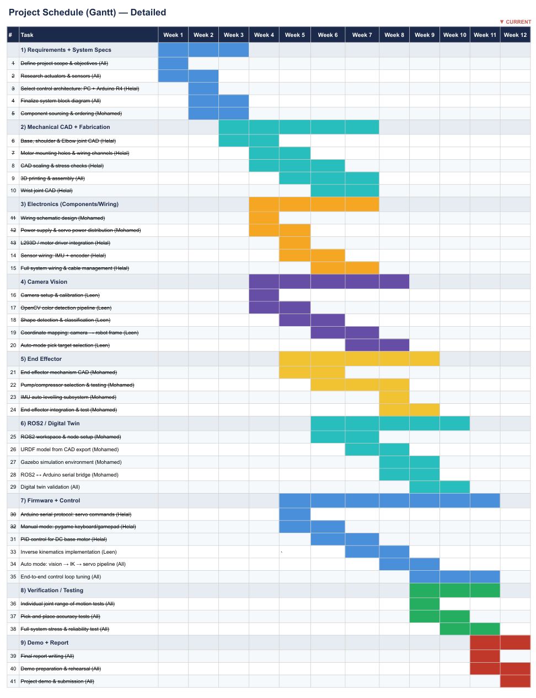

# Project Management

[← Back to Home](../index.md)

---

## Team Composition and Responsibilities

**Leen — Group Leader.** Responsible for the computer vision pipeline and overall project coordination. Created the object detection pipeline: collecting data with the Logitech camera, labelling/augmenting it in Roboflow, training the YOLOv11 model in Google Colab, and building the Python detection script that integrates the trained model into the arm control system. Maintained weekly progress reports.

**Mohamed — Member.** In charge of the end effector and suction subsystem, plus ROS digital twin work. Selected and tested the vacuum pump, designed and printed the gripper portion of the dual end effector, and assembled the suction line. On the simulation side, set up Ubuntu in a VM, installed ROS 2, and imported the CAD model into the simulation environment. Joint transformation configuration was not finalised by the end of the project.

**Helal — Member.** Designed the mechanical structure, firmware, power system, and manual control code. Created the CAD model in Autodesk Inventor; printed all 3D parts; designed and wired the power distribution (buck converter rail and decoupling capacitor bank); wrote the unified Arduino firmware for servos, DC motors, pump relay, and IMU feedback loop; created the Processing gamepad interface for manual control.

## Project Timeline

The project ran over 13 weeks: weeks 1–3 sensing and signal architecture; weeks 4–6 actuation and mechanical drive; weeks 7–9 control logic and programming; weeks 10–12 modelling, integration and demonstration; week 13 final assembly and report writing.

---

[← Back to Home](../index.md)
