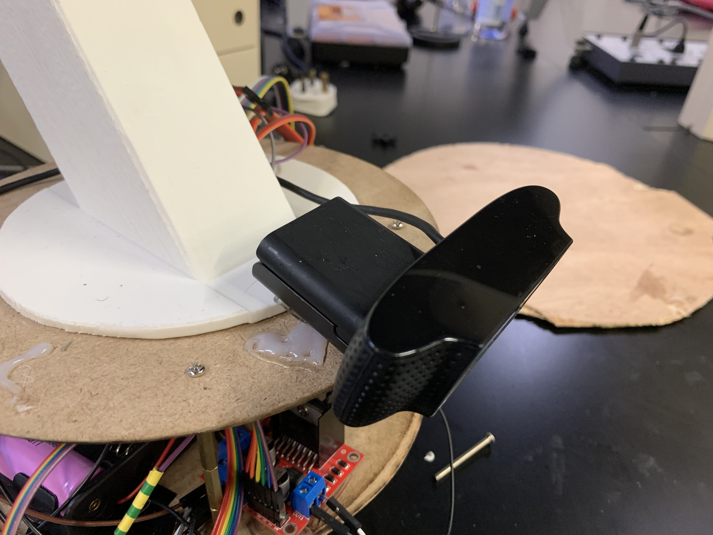

# Sensing and Signal Architecture

[← Back to Home](../index.md)

---

## Sensing Suite Overview

Three sensors: USB camera (object detection), MPU6050 IMU (orientation feedback), Bluetooth gamepad (human input). Each feeds a different control loop with different signal conditioning needs.

## Camera Subsystem

Logitech USB webcam mounted on the back of the bottom plate, lens forward and slightly down over the work surface. Fixed to the mobile base — pivots and drives with the base. The fuzzy-logic controller exploits this to centre the target box on the object. OpenCV captures the stream on the host at default camera resolution (sufficient for YOLOv11). Camera handles all signal conditioning internally (USB digital output) — the analog amplification, filtering, and ADC chain described in [1, Sec. 3.2, 3.4] is bypassed. The driver streams YUYV at 30 fps to the host; YOLOv11 receives frames and returns bounding boxes with class and confidence.

## Inertial Measurement Unit

MPU6050 — 3-axis accelerometer + 3-axis gyroscope + temperature, I²C bus. Wrist auto-levelling uses the accelerometer only. The accelerometer measures gravity; when the end effector points down, gravity is along Z; tilt shifts it into X and Y. Firmware converts raw accelerometer readings into pitch using atan2(Ax, Az), subtracts a calibration offset captured at startup, and feeds the result to the wrist PID. The MPU6050's on-die sigma-delta ADC and low-pass filter make external op-amp conditioning redundant.

## Gamepad Input

Bluetooth gamepad → host computer; read via the GameControlPlus library in Processing. Axes report −1 to +1; buttons report boolean. The Processing sketch polls every frame, applies a 0.2 deadzone to cancel analog-stick noise, maps to joint commands, and sends them over USB serial to the Arduino at 9600 baud.

---

[← Back to Home](../index.md)
