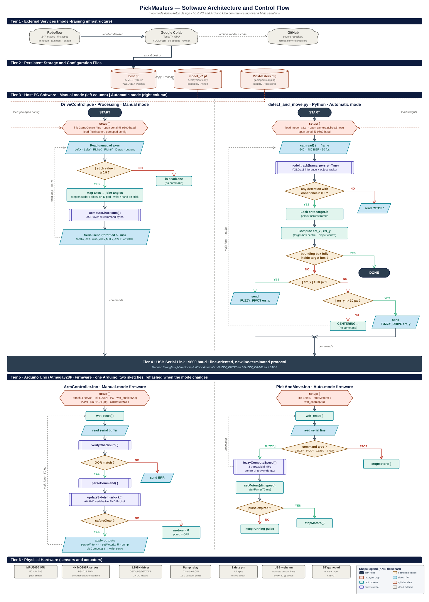
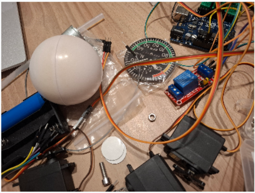
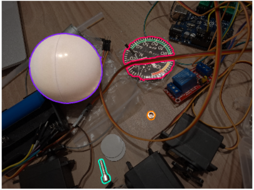
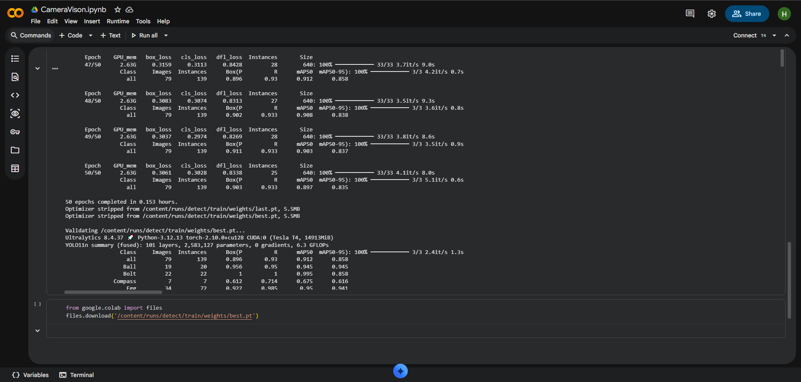
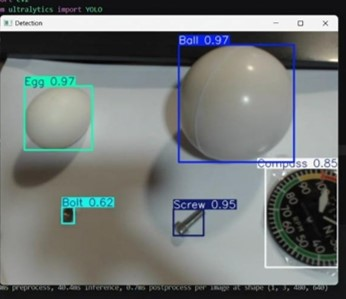
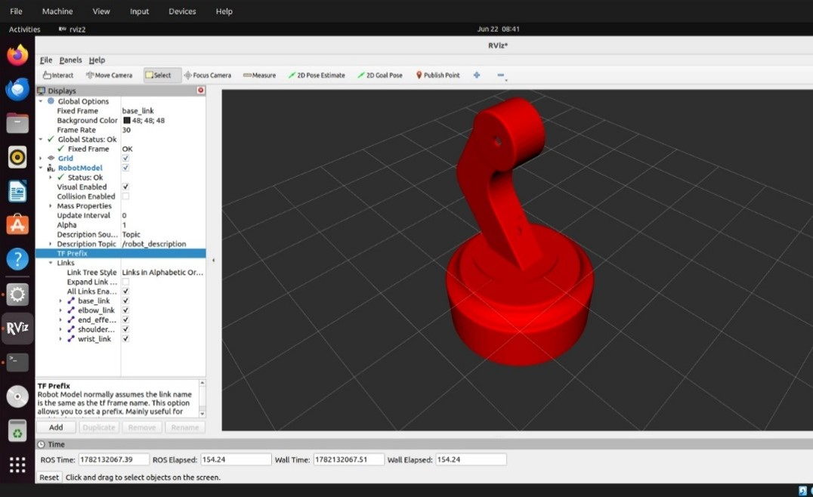

# Software Design

[← Back to Home](../index.md)

---

## Software Architecture Overview

Six layers, top to bottom: external model training services → persistent model storage and config files → host computer software → USB serial link → Arduino firmware → physical hardware. Manual mode (left half of Figure 14) uses Processing's DriveControl.pde → ArmController.ino. Automatic mode (right half) uses Python's detect_and_move.py → PickAndMove.ino. Both share the same USB serial link and the same physical hardware but run different control laws — PID on the wrist (manual) and Mamdani fuzzy on the base (auto). Standard flowchart symbology throughout: rounded terminators, hexagons (init), rectangles (process), double-bar rectangles (named function call), diamonds (decision), parallelograms (I/O), cylinders (storage), clouds (external services). Each firmware sketch's main loop refreshes the watchdog, parses serial, evaluates the safety interlock, and emits outputs.

## Computer Vision Pipeline

### Dataset Collection

237 images per class collected with the Logitech camera across five classes: Ball, Bolt, Compass, Egg, Screw. Images shot individually and in groups, under varied lighting and angles, to expose the model to deployment-time variation.

### Annotation with Roboflow

Images uploaded to Roboflow; bounding boxes drawn by hand around every instance of each target object. Pre-processing: auto-orientation, resize, auto-contrast. Augmentation: random horizontal/vertical flip, small random rotation, random brightness variation — expands the dataset without further manual labelling.

### Training with YOLOv11 on Google Colab

Trained on a Colab Tesla T4 GPU (~100× the matrix throughput of a typical laptop CPU). Dataset pulled via the Roboflow Python API. YOLOv11n trained for 50 epochs at 640×640. The "nano" variant chosen so inference is real-time on CPU at deployment. Ultralytics saves two checkpoints: `last.pt` (final epoch) and `best.pt` (highest validation mAP). `best.pt` (~5 MB) is the deployment file — copied into the inference script directory and renamed to `model_v2.pt`. Two training iterations: v1 (original images), v2 (expanded with egg and screw challenge images). Inference runs at ~15 fps on a normal laptop CPU at 640×480 — sufficient for the fuzzy loop in §9.7.

### Inference Script

`detect_and_move.py` loads `model_v2.pt`, opens the USB camera via OpenCV's VideoCapture (DirectShow backend), and opens an Arduino serial port at 9600 baud. Each loop iteration: run model in tracking mode (persistent IDs across frames), overlay bounding boxes + reference lines + the target box in the centre.

**Lock-and-track behaviour:** when no lock is held, pick the detection with the highest confidence above 50% and lock onto its tracking ID. Once locked, ignore other detections until the operator presses `n` to release.

**Per-frame errors:** signed horizontal and vertical pixel offset between the locked object's centre and the target-box centre, compared against a 30-pixel dead zone. Horizontal error out of band → `FUZZY_PIVOT <error>`. Horizontal in band, vertical out → `FUZZY_DRIVE <error>`. Both in band and object bounding box inside the target box → `STOP` and centring complete. A frame-level cooldown keeps the serial link unsaturated. Pulse-based motion (host re-sends pulses as needed) mirrors the dead-man's-switch design in §9.7.

detect_and_move.py — Python 3 | 260 lines

<pre><code>&quot;&quot;&quot;
detect_and_move.py
==================

Vision + control loop for the PickMasters arm.

The camera feed is split by ONE vertical and ONE horizontal line.  Where the two
lines cross there is a target BOX.  The job of this program is to drive the robot
(DC motors only) until the chosen item sits completely inside that box:

  * VERTICAL line   -&gt; handled by SPINNING the base (pivot the wheels left/right)
                       so the item lines up on the vertical (X) axis.
  * HORIZONTAL line -&gt; handled by MOVING the base forward/back (drive both wheels)
                       so the item lines up on the horizontal (Y) axis.

Locking behaviour
-----------------
The program will only LOCK onto an item once it is seen with &gt;= 80% confidence.
After that it stays focused on the SAME item and keeps centering it, even if the
confidence drops, until you press the &quot;next&quot; key (n).  Then it releases the lock
and is free to pick the next &gt;= 80% item.

Keys
----
  n : release the current lock and look for the next item
  s : send an emergency STOP to the Arduino
  q : quit

Serial protocol (sent to the Arduino, one command per line)
-----------------------------------------------------------
  PIVOT_LEFT  &lt;speed&gt;   spin base left
  PIVOT_RIGHT &lt;speed&gt;   spin base right
  DRIVE_FWD   &lt;speed&gt;   move base forward
  DRIVE_BACK  &lt;speed&gt;   move base backward
  STOP                  stop all DC motors
&quot;&quot;&quot;

import os
import cv2
from ultralytics import YOLO
import serial
import time

# --------------------------------------------------------------------------- #
#  Configuration
# --------------------------------------------------------------------------- #
SERIAL_PORT = &quot;COM10&quot;          # change to match your Arduino port
BAUD_RATE   = 9600

# Locate model_v2.pt next to this script so the path works on any machine.
SCRIPT_DIR = os.path.dirname(os.path.abspath(__file__))
MODEL_PATH = os.path.join(SCRIPT_DIR, &quot;model_v2.pt&quot;)

CAMERA_INDEX = 0

FRAME_WIDTH  = 640
FRAME_HEIGHT = 480
CENTER_X     = FRAME_WIDTH  // 2
# Shift the target (box + horizontal line) lower on the Y axis. Increase
# BOX_Y_OFFSET to push it further down the frame.
BOX_Y_OFFSET = 80
CENTER_Y     = FRAME_HEIGHT // 2 + BOX_Y_OFFSET

# Half-size of the target box drawn at the crossing of the two lines.
# The item must fit COMPLETELY inside this box.
BOX_HALF_W = 55
BOX_HALF_H = 55

BOX_LEFT   = CENTER_X - BOX_HALF_W
BOX_RIGHT  = CENTER_X + BOX_HALF_W
BOX_TOP    = CENTER_Y - BOX_HALF_H
BOX_BOTTOM = CENTER_Y + BOX_HALF_H

# How close (in pixels) the item centre must be to a line before we stop nudging
# on that axis.  Keep this smaller than the box so the item ends up well inside.
DEAD_ZONE_X = 30
DEAD_ZONE_Y = 30

LOCK_CONFIDENCE = 0.50         # must reach this to LOCK onto an item

PIVOT_SPEED = 90               # PWM (0-255) the Arduino uses while spinning base
DRIVE_SPEED = 130              # PWM (0-255) the Arduino uses while driving base

COOLDOWN_MAX = 6               # frames to wait between motion pulses (higher = gentler)

# --------------------------------------------------------------------------- #
#  Setup
# --------------------------------------------------------------------------- #
model = YOLO(MODEL_PATH)
# Use the DirectShow backend on Windows -- the default backend can hang for a
# long time while opening the camera.
cap = cv2.VideoCapture(CAMERA_INDEX, cv2.CAP_DSHOW)
cap.set(cv2.CAP_PROP_FRAME_WIDTH,  FRAME_WIDTH)
cap.set(cv2.CAP_PROP_FRAME_HEIGHT, FRAME_HEIGHT)

if not cap.isOpened():
    raise RuntimeError(
        f&quot;Could not open camera index {CAMERA_INDEX}. &quot;
        f&quot;Try a different CAMERA_INDEX (0, 1, 2 ...).&quot;
    )

try:
    arduino = serial.Serial(SERIAL_PORT, BAUD_RATE, timeout=1)
    time.sleep(2)
    print(&quot;Arduino connected!&quot;)
except Exception as e:
    print(f&quot;Arduino not found: {e}&quot;)
    arduino = None

def send(command):
    &quot;&quot;&quot;Send a single line command to the Arduino (and echo to the console).&quot;&quot;&quot;
    print(f&quot;Sent: {command}&quot;)
    if arduino:
        try:
            arduino.write((command + &quot;\n&quot;).encode())
        except Exception as e:
            print(f&quot;Send error: {e}&quot;)

# --------------------------------------------------------------------------- #
#  Main loop
# --------------------------------------------------------------------------- #
locked_id = None               # track id of the item we are focused on
cooldown  = 0

while True:
    ret, frame = cap.read()
    if not ret:
        break

    # Use tracking so each item keeps a stable id between frames.  This is what
    # lets us stay locked on one item even when its confidence drops.
    results = model.track(frame, persist=True, verbose=False)
    annotated = results[0].plot()

    # ---- Draw the two reference lines and the target box ------------------- #
    cv2.line(annotated, (CENTER_X, 0), (CENTER_X, FRAME_HEIGHT), (255, 0, 0), 2)
    cv2.line(annotated, (0, CENTER_Y), (FRAME_WIDTH, CENTER_Y), (255, 0, 0), 2)
    cv2.rectangle(annotated, (BOX_LEFT, BOX_TOP), (BOX_RIGHT, BOX_BOTTOM),
                  (0, 255, 255), 2)

    boxes = results[0].boxes

    # Build a lookup of the boxes that currently have a track id.
    tracked = {}
    if boxes is not None and boxes.id is not None:
        for i in range(len(boxes)):
            tid = int(boxes.id[i])
            tracked[tid] = boxes[i]

    # ---- Acquire a lock if we don&#x27;t have one ------------------------------ #
    if locked_id is None or locked_id not in tracked:
        # Look for the highest-confidence item that clears the 80% threshold.
        best_id, best_conf = None, 0.0
        for tid, box in tracked.items():
            conf = float(box.conf[0])
            if conf &gt;= LOCK_CONFIDENCE and conf &gt; best_conf:
                best_id, best_conf = tid, conf

        if best_id is not None:
            locked_id = best_id
            print(f&quot;LOCKED onto item id {locked_id} ({best_conf:.2f})&quot;)
        else:
            # Nothing to lock onto -&gt; make sure the robot is stopped.
            if cooldown == 0:
                send(&quot;STOP&quot;)
                cooldown = COOLDOWN_MAX
            locked_id = None

    # ---- Drive toward the locked item ------------------------------------- #
    if locked_id is not None and locked_id in tracked:
        box = tracked[locked_id]
        class_name = results[0].names[int(box.cls[0])]
        confidence = float(box.conf[0])

        x1, y1, x2, y2 = map(int, box.xyxy[0])
        obj_cx = (x1 + x2) // 2
        obj_cy = (y1 + y2) // 2

        cv2.circle(annotated, (obj_cx, obj_cy), 8, (0, 0, 255), -1)

        # Is the whole item inside the box?
        fully_inside = (x1 &gt;= BOX_LEFT and x2 &lt;= BOX_RIGHT and
                        y1 &gt;= BOX_TOP  and y2 &lt;= BOX_BOTTOM)

        command = None
        if fully_inside:
            # Item is completely inside the box -&gt; we&#x27;re done. Stop and quit.
            send(&quot;STOP&quot;)
            status, color = f&quot;DONE - {class_name} in box&quot;, (0, 255, 0)
            cv2.putText(annotated, status, (10, 50),
                        cv2.FONT_HERSHEY_SIMPLEX, 0.8, color, 2)
            cv2.imshow(&quot;Pick &amp; Move&quot;, annotated)
            cv2.waitKey(800)          # show the result briefly
            print(f&quot;Item id {locked_id} ({class_name}) fully inside box. Quitting.&quot;)
            break
        elif obj_cx &lt; CENTER_X - DEAD_ZONE_X:
            err_x = obj_cx - CENTER_X
            command = f&quot;FUZZY_PIVOT {err_x}&quot;
            status, color = f&quot;FUZZY PIVOT LEFT (err={err_x})&quot;, (0, 255, 255)
        elif obj_cx &gt; CENTER_X + DEAD_ZONE_X:
            err_x = obj_cx - CENTER_X
            command = f&quot;FUZZY_PIVOT {err_x}&quot;
            status, color = f&quot;FUZZY PIVOT RIGHT (err={err_x})&quot;, (0, 255, 255)
        elif obj_cy &lt; CENTER_Y - DEAD_ZONE_Y:
            err_y = CENTER_Y - obj_cy
            command = f&quot;FUZZY_DRIVE {err_y}&quot;
            status, color = f&quot;FUZZY DRIVE FWD (err={err_y})&quot;, (255, 165, 0)
        elif obj_cy &gt; CENTER_Y + DEAD_ZONE_Y:
            err_y = CENTER_Y - obj_cy
            command = f&quot;FUZZY_DRIVE {err_y}&quot;
            status, color = f&quot;FUZZY DRIVE BACK (err={err_y})&quot;, (255, 165, 0)
        else:
            # Centre is on the cross but the box isn&#x27;t fully contained yet
            # (item bigger than the dead zone) -&gt; nudge it the rest of the way.
            command = None
            status, color = &quot;CENTERING...&quot;, (0, 255, 0)

        if cooldown == 0:
            send(command if command else &quot;STOP&quot;)
            cooldown = COOLDOWN_MAX

        cv2.putText(annotated, status, (10, 50),
                    cv2.FONT_HERSHEY_SIMPLEX, 0.8, color, 2)
        cv2.putText(annotated, f&quot;LOCK id{locked_id} {class_name} {confidence:.2f}&quot;,
                    (10, 90), cv2.FONT_HERSHEY_SIMPLEX, 0.7, (255, 255, 255), 2)

    elif locked_id is not None:
        # We have a lock but lost sight of it this frame -&gt; hold position.
        if cooldown == 0:
            send(&quot;STOP&quot;)
            cooldown = COOLDOWN_MAX
        cv2.putText(annotated, f&quot;SEARCHING for locked id {locked_id}&quot;,
                    (10, 50), cv2.FONT_HERSHEY_SIMPLEX, 0.8, (0, 0, 255), 2)
    else:
        cv2.putText(annotated, &quot;No &gt;=80% item to lock onto&quot;,
                    (10, 50), cv2.FONT_HERSHEY_SIMPLEX, 0.8, (0, 0, 255), 2)

    if cooldown &gt; 0:
        cooldown -= 1

    cv2.imshow(&quot;Pick &amp; Move&quot;, annotated)
    key = cv2.waitKey(1) &amp; 0xFF
    if key == ord(&#x27;q&#x27;):
        break
    elif key == ord(&#x27;n&#x27;):
        # Release the lock so the next &gt;=80% item can be chosen.
        print(f&quot;Released lock on id {locked_id}&quot;)
        locked_id = None
        send(&quot;STOP&quot;)
    elif key == ord(&#x27;s&#x27;):
        send(&quot;STOP&quot;)

send(&quot;STOP&quot;)
cap.release()
cv2.destroyAllWindows()
if arduino:
    arduino.close()
</code></pre>

## Manual Control Software

Processing IDE — chosen because GameControlPlus already handles Bluetooth gamepads and Processing's `draw()` loop fits gamepad polling cleanly. Polls every axis at 50 Hz, applies a deadzone, and converts to serial commands. Mapping: left stick — base wheels (up/down forward/back, left/right rotate); right stick — hand/claw override; D-pad — shoulder and elbow up/down; face buttons — pump on/off, IMU calibration, end-effector control override.

DriveControl.pde — Processing (Java) | 231 lines

<pre><code>// PickMasters — DriveControl (manual controller, paired with ArmController.ino)
//
// Bluetooth XINPUT gamepad via GameControlPlus (config: data/PickMasters).
//
// Mapping:
//   Left stick (digital)  — base drive: fully forward/back = both wheels,
//                           fully left/right = pivot in place. Constant speed.
//   D-pad up/down         — shoulder servo  (±step per frame while held)
//   D-pad left/right      — elbow servo     (±step per frame while held)
//   Right stick Y         — wrist servo  (digital: full push only, MANUAL mode)
//   Right stick X         — hand servo   (digital: full push only)
//   PumpButton            — pump on/off toggle        (rising edge)
//   CalButton             — IMU re-zero (&quot;cal&quot;)       (rising edge)
//   WristModeButton       — wrist AUTO/MANUAL toggle  (rising edge)
//
// Serial: ONE combined message per frame, sent only when something changed
// and at most every SEND_INTERVAL ms, to avoid flooding the Arduino:
//   S&lt;shoulder&gt;,&lt;elbow&gt;,&lt;wrist&gt;,&lt;hand&gt;,M&lt;left&gt;,&lt;right&gt;,P&lt;0|1&gt;,W&lt;0|1&gt;\n

import org.gamecontrolplus.*;
import org.gamecontrolplus.gui.*;
import g4p_controls.*;
import processing.serial.*;
import net.java.games.input.*;

ControlDevice cont;
ControlIO control;
Serial port;
boolean controllerReady = false;

// --- Servo state ---
float shoulderAngle = 90;
float elbowAngle    = 90;
float wristAngle    = 90;
float handAngle     = 90;

float dpadStep  = 3.0;   // deg per frame while D-pad held (shoulder/elbow)
float stickStep = 3.0;   // deg per frame while right stick fully pushed (wrist/hand)

// --- Drive state (digital: stick must be fully pushed) ---
float driveThreshold = 0.9;
int motorLeft  = 0;      // -1 / 0 / +1, Arduino applies its constant speed
int motorRight = 0;

boolean pumpOn    = false;
boolean wristAuto = true;   // true = IMU leveling, false = right stick Y

// --- Button edge detection ---
boolean prevPumpBtn = false;
boolean prevCalBtn  = false;
boolean prevModeBtn = false;

// --- Serial throttle: send only on change, at most every SEND_INTERVAL ms ---
String lastMsg  = &quot;&quot;;
long   lastSend = 0;
final int SEND_INTERVAL = 50;

String lastResponse = &quot;&quot;;

void setup() {
  size(440, 290);
  frameRate(50);

  // GCP on Windows enumerates every input device (including virtual ones like
  // FakerInput).  Wrapping init in try/catch lets us recover gracefully.
  try {
    control = ControlIO.getInstance(this);
    cont = control.getMatchedDevice(&quot;PickMasters&quot;);
  } catch (Exception e) {
    println(&quot;Warning during controller init: &quot; + e.getMessage());
  }

  if (cont == null) {
    println(&quot;Controller not found — check data/PickMasters config&quot;);
    System.exit(-1);
  }
  controllerReady = true;

  // Pick the Arduino&#x27;s serial port automatically: COM1 is almost always the
  // PC&#x27;s built-in port, so prefer the last port that isn&#x27;t COM1.  If the
  // Arduino is unplugged (or its driver is missing) no usable port exists.
  String[] ports = Serial.list();
  printArray(ports);

  String portName = null;
  for (int i = ports.length - 1; i &gt;= 0; i--) {
    if (!ports[i].equals(&quot;COM1&quot;)) { portName = ports[i]; break; }
  }
  if (portName == null &amp;&amp; ports.length &gt; 0) portName = ports[0];

  if (portName == null) {
    println(&quot;No serial port found — is the Arduino plugged in?&quot;);
    System.exit(-1);
  }

  println(&quot;Connecting to &quot; + portName);
  port = new Serial(this, portName, 9600);
  port.bufferUntil(&#x27;\n&#x27;);

  delay(2000);   // let the Arduino reboot after the port opens
}

void getUserInput() {
  if (!controllerReady || cont == null) return;
  float leftX  = cont.getSlider(&quot;LeftX&quot;).getValue();
  float leftY  = cont.getSlider(&quot;LeftY&quot;).getValue();
  float rightX = cont.getSlider(&quot;RightX&quot;).getValue();
  float rightY = cont.getSlider(&quot;RightY&quot;).getValue();

  // --- Base DC motors: digital only, single constant speed ---
  // Stick must be fully pushed (gamepads read negative Y when pushed forward).
  // Forward/back wins; left/right pivots in place (never mixed with fwd/back).
  if (leftY &lt;= -driveThreshold)      { motorLeft =  1; motorRight =  1; }  // forward
  else if (leftY &gt;= driveThreshold)  { motorLeft = -1; motorRight = -1; }  // backward
  else if (leftX &gt;= driveThreshold)  { motorLeft =  1; motorRight = -1; }  // pivot right
  else if (leftX &lt;= -driveThreshold) { motorLeft = -1; motorRight =  1; }  // pivot left
  else                               { motorLeft =  0; motorRight =  0; }

  // --- Shoulder &amp; elbow on the D-pad (fixed step per frame while held) ---
  // GameControlPlus hat positions: 0 = released, then clockwise from
  // 1 = up-left: 2 = up, 3 = up-right, 4 = right, 5 = down-right,
  // 6 = down, 7 = down-left, 8 = left.
  int pos = cont.getHat(&quot;Dpad&quot;).getPos();
  boolean dUp    = (pos == 1 || pos == 2 || pos == 3);
  boolean dDown  = (pos == 5 || pos == 6 || pos == 7);
  boolean dRight = (pos == 3 || pos == 4 || pos == 5);
  boolean dLeft  = (pos == 7 || pos == 8 || pos == 1);

  if (dUp)    shoulderAngle += dpadStep;
  if (dDown)  shoulderAngle -= dpadStep;
  if (dRight) elbowAngle    += dpadStep;
  if (dLeft)  elbowAngle    -= dpadStep;

  // --- Wrist (right stick Y, MANUAL only) &amp; hand (right stick X): DIGITAL ---
  // Like the drive sticks — the servo only moves at FULL deflection, stepping a
  // fixed amount per frame. No proportional/rate control: half-pushed does nothing.
  if (!wristAuto) {
    if (rightY &lt;= -driveThreshold)     wristAngle += stickStep;   // stick up   = wrist up
    else if (rightY &gt;= driveThreshold) wristAngle -= stickStep;   // stick down = wrist down
  }
  if (rightX &gt;= driveThreshold)        handAngle += stickStep;    // stick right = hand +
  else if (rightX &lt;= -driveThreshold)  handAngle -= stickStep;    // stick left  = hand -

  shoulderAngle = constrain(shoulderAngle, 0, 180);
  elbowAngle    = constrain(elbowAngle,    0, 180);
  wristAngle    = constrain(wristAngle,    0, 180);
  handAngle     = constrain(handAngle,     0, 180);

  // --- Buttons (rising edge only) ---
  boolean pumpBtn = cont.getButton(&quot;PumpButton&quot;).pressed();
  boolean calBtn  = cont.getButton(&quot;CalButton&quot;).pressed();
  boolean modeBtn = cont.getButton(&quot;WristModeButton&quot;).pressed();

  if (pumpBtn &amp;&amp; !prevPumpBtn) pumpOn = !pumpOn;
  if (modeBtn &amp;&amp; !prevModeBtn) wristAuto = !wristAuto;
  if (calBtn &amp;&amp; !prevCalBtn)   port.write(&quot;cal\n&quot;);

  prevPumpBtn = pumpBtn;
  prevCalBtn  = calBtn;
  prevModeBtn = modeBtn;
}

void sendState() {
  // ONE combined message per frame — only when it changed, throttled to
  // SEND_INTERVAL, written with port.write() (no println), to keep the
  // Arduino&#x27;s serial buffer from overflowing and dropping the connection.
  String msg = &quot;S&quot; + (int)shoulderAngle + &quot;,&quot; + (int)elbowAngle + &quot;,&quot;
                   + (int)wristAngle + &quot;,&quot; + (int)handAngle
             + &quot;,M&quot; + motorLeft + &quot;,&quot; + motorRight
             + &quot;,P&quot; + (pumpOn ? 1 : 0)
             + &quot;,W&quot; + (wristAuto ? 1 : 0) + &quot;\n&quot;;

  if (!msg.equals(lastMsg) &amp;&amp; millis() - lastSend &gt;= SEND_INTERVAL) {
    port.write(msg);
    lastMsg  = msg;
    lastSend = millis();
  }
}

void draw() {
  // ConcurrentModificationException is a known GCP library bug (device list
  // iterated on two threads simultaneously).  Catching it here lets the sketch
  // keep running instead of crashing — the missed frame is harmless.
  try {
    getUserInput();
  } catch (java.util.ConcurrentModificationException e) {
    // skip this frame&#x27;s input, will re-read next frame
  }
  sendState();

  background(40, 60, 100);

  fill(255);
  textSize(16);
  text(&quot;PickMasters  —  Manual Mode&quot;, 10, 28);

  textSize(14);
  fill(200, 230, 255);
  text(&quot;Shoulder:  &quot; + (int)shoulderAngle + &quot; deg&quot;, 10, 60);
  text(&quot;Elbow:     &quot; + (int)elbowAngle + &quot; deg&quot;, 10, 82);
  text(&quot;Wrist:     &quot; + (int)wristAngle + &quot; deg&quot;, 10, 104);
  text(&quot;Hand:      &quot; + (int)handAngle + &quot; deg&quot;, 10, 126);
  text(&quot;Motors:    L &quot; + motorState(motorLeft) + &quot;   R &quot; + motorState(motorRight), 10, 148);

  fill(pumpOn ? color(80, 255, 80) : color(255, 80, 80));
  text(&quot;Pump:      &quot; + (pumpOn ? &quot;ON&quot; : &quot;OFF&quot;), 10, 170);

  fill(wristAuto ? color(120, 200, 255) : color(255, 200, 80));
  text(&quot;Wrist mode: &quot; + (wristAuto ? &quot;AUTO (IMU)&quot; : &quot;MANUAL (right stick Y)&quot;), 10, 192);

  fill(160);
  textSize(11);
  text(&quot;Left stick: drive (full push)   D-pad: shoulder/elbow   Right stick: wrist/hand&quot;, 10, 230);
  text(&quot;PumpButton: pump   CalButton: IMU re-zero   WristModeButton: AUTO/MANUAL&quot;, 10, 247);
  fill(220);
  text(&quot;Arduino: &quot; + lastResponse, 10, 275);
}

String motorState(int dir) {
  if (dir &gt; 0) return &quot;FWD&quot;;
  if (dir &lt; 0) return &quot;REV&quot;;
  return &quot;STOP&quot;;
}

void serialEvent(Serial p) {
  String msg = p.readStringUntil(&#x27;\n&#x27;);
  if (msg != null) {
    lastResponse = msg.trim();
    println(lastResponse);
  }
}
</code></pre>

## Robot Operating System 2 Simulation

ROS 2 on an Ubuntu VM. Goal: a digital twin showing live joint positions and allowing trajectory testing virtually before running on hardware. The CAD model was successfully imported and rendered in RViz. Joint transformations were not finalised by the project deadline, so the model renders but does not articulate correctly.

---

[← Back to Home](../index.md)
